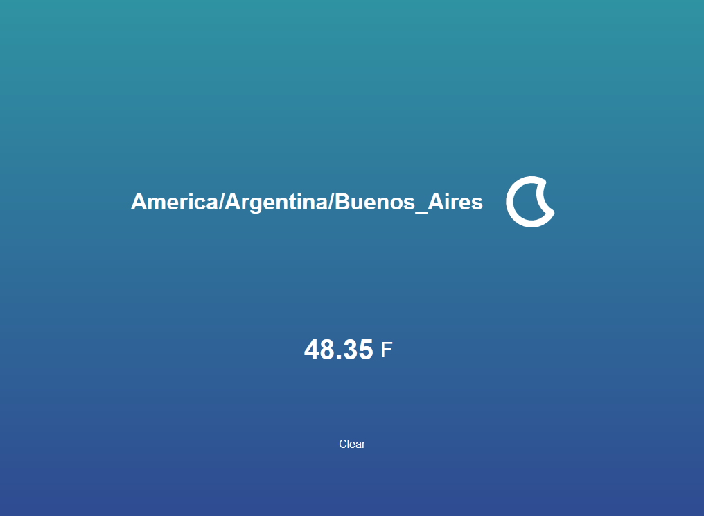
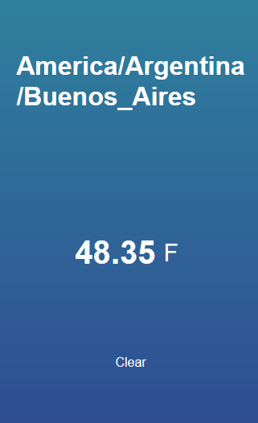

# Weather-App

Little project Wearther App using Javascript.

## About the app 
This is a small and basic weather app that I made from a youtube tutorial using <a href="https://darksky.net/forecast">Dark Sky by Apple API</a> and the animated weather icons are from 
<a href="https://darkskyapp.github.io/skycons/">Skycons</a> where you can find a set of ten animated weather glyphs, procedurally generated by JavaScript using the HTML5 canvas tag.

I think the API can't be used anymore but the code serves as an example for future projects.

Here are a couple of screenshots.

